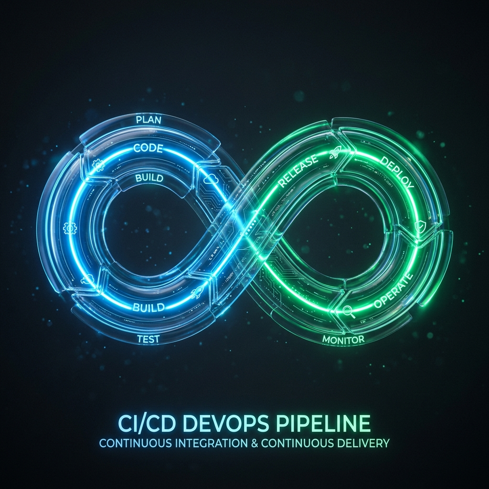

  

  # Sagar Tongar
  ### Expert CI/CD, DevOps & Cloud Infrastructure Lead
  
  

    <a href="https://github.com/SagarTongar">GitHub</a> • 
    <a href="https://www.linkedin.com/in/sagar-tongar-b5065619a/">LinkedIn</a> • 
    <a href="mailto:sagartongar83@gmail.com">Email</a>
  

  

    
    
    
    
    
    
  

---

## ⚡ About Me
I am a **DevOps & Cloud Lead** specializing in building highly scalable, secure, and self-healing cloud architectures. I believe that complexity is the enemy of reliability. I focus on creating automated, resilient, and cost-optimized infrastructures tailored to exact business needs.

If you need robust **CI/CD pipelines, Infrastructure as Code (IaC), or seamless Cloud Migrations**, I can help you build and scale.

---

## 🛠️ Core Engineering Competencies

<table>
  <tr>
    <td align="center" width="50%">
      <h3>☁️ Infrastructure & Cloud</h3>
      
Building resilient, highly available data centers.

      <b>AWS • Terraform • Kubernetes • Docker • EKS • Helm</b>
    </td>
    <td align="center" width="50%">
      <h3>🔄 Automation & CI/CD</h3>
      
Automated, infinite deployment loops.

      <b>GitLab • GitHub Actions • Jenkins • ArgoCD • GitOps</b>
    </td>
  </tr>
  <tr>
    <td align="center" width="50%">
      <h3>🛡️ Observability & DevSecOps</h3>
      
Zero-trust security and proactive alerting.

      <b>Prometheus • Grafana • SonarQube • Trivy • Checkmarx • Sysdig</b>
    </td>
    <td align="center" width="50%">
      <h3>🧠 Leadership & Strategy</h3>
      
Architecting for zero downtime and maximum efficiency.

      <b>Resilient Architecture • Cloud FinOps • Technical Leadership</b>
    </td>
  </tr>
</table>

---

## 🏆 Certifications

- **Kubernetes CKA Certified** *(Cloud Native Computing Foundation)*
- **Red Hat Certified System Administrator** *(Red Hat)*
- **Microsoft Certified: Azure Administrator Associate** *(Microsoft)*
- **AWS Certified Cloud Practitioner** *(Amazon Web Services)*

---

## 🌐 Explore My Live Portfolio

This repository houses the source code for my interactive, 3D-accelerated Web Portfolio. 
It features a complete "Cloud Console" theme built with **React, Vite, Tailwind CSS, and Framer Motion**.

👉 **[View My Live Portfolio Here](https://SagarTongar.github.io/)**

  

